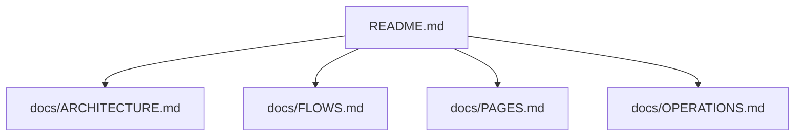

# StayMini

給台灣獨立民宿屋主的單民宿官網與訂房詢問模板。狀態：MVP / Phase 0；repo 無部署設定或上線紀錄，無法從程式碼判定已上線。

StayMini 使用 Next.js 15 App Router、React 19、TypeScript、Tailwind CSS。現有功能包含首頁與房型頁、訂房詢問 Server Action、Basic Auth 保護的屋主詢問列表、Mailgun 詢問通知、NewebPay 付款 API、Smart Router 民宿介紹文 API。Runtime 資料目前存在 in-memory store；Prisma/PostgreSQL schema 已建立但尚未接到頁面與 API。



## 📚 專案文件

- [系統架構](docs/ARCHITECTURE.md)：技術棧、元件關係、主要目錄、Prisma 資料模型。
- [操作與業務流程](docs/FLOWS.md)：房型瀏覽、詢問送出、admin、NewebPay、AI 文案流程。
- [頁面/路由/API 清單](docs/PAGES.md)：所有頁面路由、API endpoints、Server Action 與重要模組。
- [安裝、執行、部署、維運](docs/OPERATIONS.md)：環境需求、scripts、env、部署與上線前檢查。

## 快速開始

```bash
npm install
cp .env.example .env.local
npm run dev
```

本機預設網址：`http://localhost:3000`。

若要打開 `/admin/inquiries`，需在 `.env.local` 設定：

```bash
ADMIN_USER=your-admin-user
ADMIN_PASSWORD=your-admin-password
```

## 常用指令

| 指令 | 用途 |
| --- | --- |
| `npm run dev` | 啟動 Next.js 開發伺服器 |
| `npm run build` | 建立 production build |
| `npm run start` | 啟動 production server |
| `npm run typecheck` | 執行 `tsc --noEmit` |
| `npm run lint` | 執行 `next lint` script |
| `npm run db:seed` | 執行 `tsx prisma/seed.ts`，將 sample rooms 寫入 Prisma DB |

## 主要功能

- `/`：首頁 hero、特色區、三間房型預覽。
- `/rooms`、`/rooms/[slug]`：房型列表與詳情。
- `/inquiry`：訂房詢問表單，送出後寫入 in-memory inquiry store。
- `/admin/inquiries`：屋主後台詢問列表，由 `ADMIN_USER` / `ADMIN_PASSWORD` Basic Auth 保護。
- `/api/payment/newebpay/*`：NewebPay checkout、return、notify API。
- `/api/listing-blurb`：透過 Smart Router 產生民宿介紹文。
- `/terms`、`/privacy`、`/refund`：服務條款、隱私權政策、退訂政策。

## 客製入口

| 檔案 | 用途 |
| --- | --- |
| `src/lib/site-config.ts` | 民宿名稱、tagline、屋主聯絡方式、地址、地圖、hero 圖 |
| `src/lib/company.ts` | 公司名稱、統編、登記地址、客服 Email、LINE |
| `src/lib/rooms-store.ts` | 三間 sample 房型資料 |
| `tailwind.config.ts` | 字體、色彩、border radius |
| `prisma/schema.prisma` | PostgreSQL schema 預留 |
| `prisma/seed.ts` | 房型 seed |

## 重要限制

- 詢問、訂單、booking 目前存在 in-memory store；server 重啟或 serverless instance 更換會遺失。
- Prisma schema 已存在，但 runtime 尚未使用 `prisma.inquiry.*`、`prisma.room.*`、`prisma.order.*`。
- Runtime `OrderProvider` 使用 `NEWEBPAY`，Prisma schema 目前 enum 是 `ECPAY` / `STRIPE`；切換 DB 前需對齊。
- `siteConfig`、`COMPANY`、圖片、Google Maps iframe 仍含 demo / placeholder 資料。
- repo 無 Docker、compose、Makefile、`vercel.json`；部署採標準 Next.js build/start 或 Vercel 專案設定。

## License

Private. © Mike Feng.
