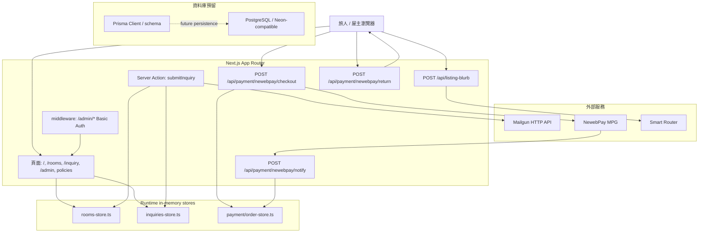
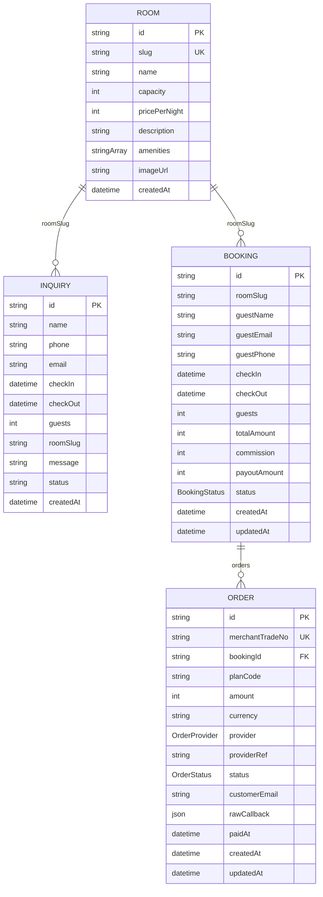

# StayMini 系統架構

## 專案總覽

StayMini 是給台灣獨立民宿屋主使用的單民宿官網模板。它提供房型展示、訂房詢問表單、屋主後台詢問列表、Mailgun 詢問通知、NewebPay 付款流程 API，以及一個透過 Smart Router 產生民宿介紹文的 API。現階段 runtime 資料主要存在 in-memory store；`prisma/schema.prisma` 已定義 PostgreSQL 資料模型，但目前頁面與 API 尚未改用 Prisma 持久化。

## 技術棧

| 類別 | 實際技術 / 套件 | 用途 |
| --- | --- | --- |
| Web 框架 | `next` 15.1、App Router | 頁面、Route Handler、Server Action、middleware |
| 前端 | `react` 19、`react-dom` 19、TypeScript | React UI 與型別檢查 |
| 樣式 | Tailwind CSS 3、`class-variance-authority`、`clsx`、`tailwind-merge` | utility-first 樣式與 UI variant 合併 |
| UI 輔助 | `@radix-ui/react-slot`、`lucide-react` | shadcn-style Button slot 與圖示套件 |
| 後端執行 | Next.js Route Handlers、Server Actions | 表單送出、付款 API、AI 文案 API |
| Runtime 資料 | `src/lib/*-store.ts` in-memory store | 房型、詢問、訂單、booking 暫存；程序重啟會消失 |
| 資料庫 schema | Prisma 5、PostgreSQL datasource | `Inquiry`、`Room`、`Booking`、`Order` schema 與 seed 預留 |
| 金流 | NewebPay MPG gateway、自製 AES/SHA 工具 | 建立 checkout payload、接收 return / notify callback |
| Email | Mailgun HTTP API | 新詢問 best-effort 寄信通知屋主 |
| AI 服務 | Smart Router HTTP endpoint | `/api/listing-blurb` 產生 60-90 字民宿介紹文 |
| 部署 | Next.js build/start；Vercel-compatible | repo 無 `vercel.json`、Dockerfile 或 compose 設定 |

## 元件關係

## 主要目錄

| 路徑 | 用途 |
| --- | --- |
| `src/app/` | Next.js App Router 頁面、API route、layout、middleware 相關頁面入口 |
| `src/app/api/listing-blurb/` | Smart Router 文案產生 API |
| `src/app/api/payment/newebpay/` | NewebPay checkout、browser return、server notify API |
| `src/app/inquiry/` | 訂房詢問頁、client form、Server Action、感謝頁 |
| `src/app/admin/inquiries/` | 屋主查看詢問列表頁 |
| `src/components/ui/` | Button、Card、Input、Badge 等 shadcn-style 基礎元件 |
| `src/lib/` | 設定、房型/詢問 store、Prisma singleton、Mailgun、Smart Router client、工具函式 |
| `src/lib/payment/` | NewebPay crypto/payload、方案定價、order/booking in-memory store |
| `prisma/` | Prisma schema 與 seed script |
| `docs/` | 技術文件 |

## 資料模型概覽

目前 runtime 使用 `src/lib/rooms-store.ts`、`src/lib/inquiries-store.ts`、`src/lib/payment/order-store.ts`。`prisma/schema.prisma` 宣告以下模型，作為切換 PostgreSQL 持久化時的資料結構基礎。

`Inquiry.roomSlug` 與 `Booking.roomSlug` 是字串對應，Prisma schema 沒有建立對 `Room.slug` 的外鍵。`Booking` 與 `Order` 有正式 Prisma relation。另注意：runtime `order-store.ts` 的 `OrderProvider` 型別為 `NEWEBPAY`，但 Prisma schema 目前 enum 是 `ECPAY` / `STRIPE`；切換 Prisma 前需先對齊。
