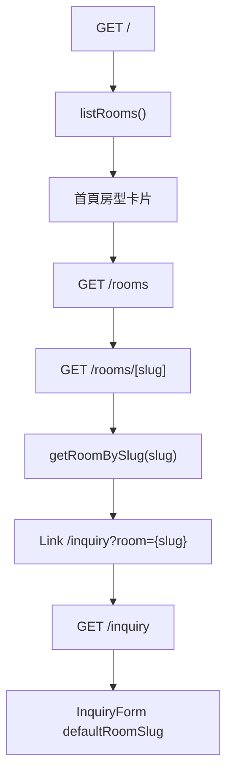
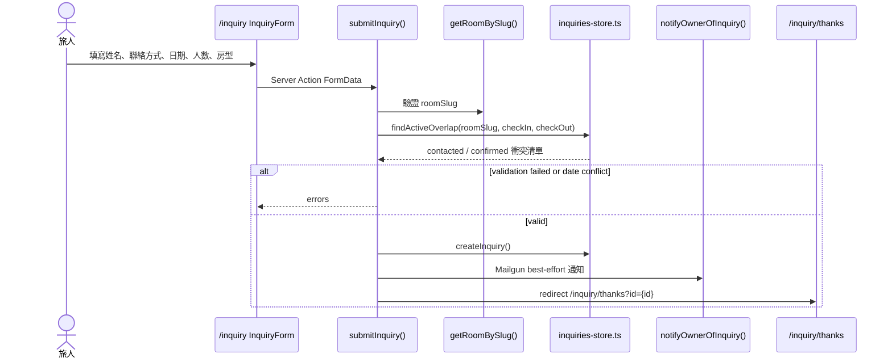
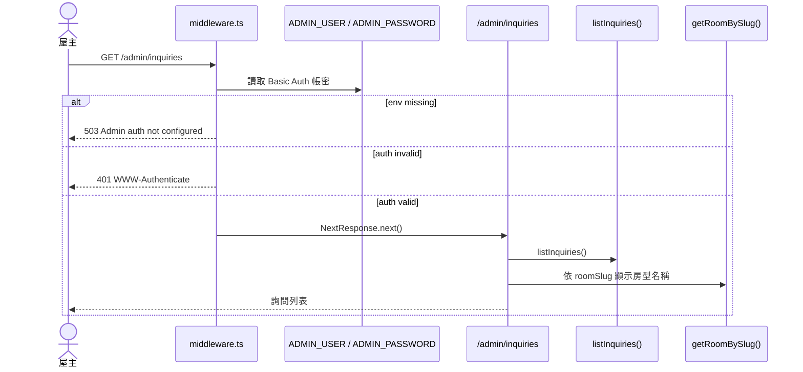
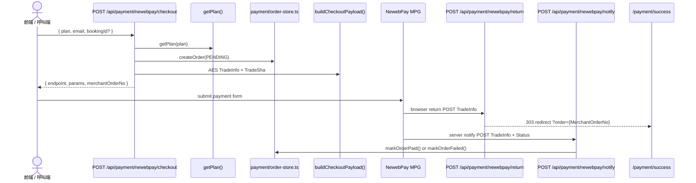
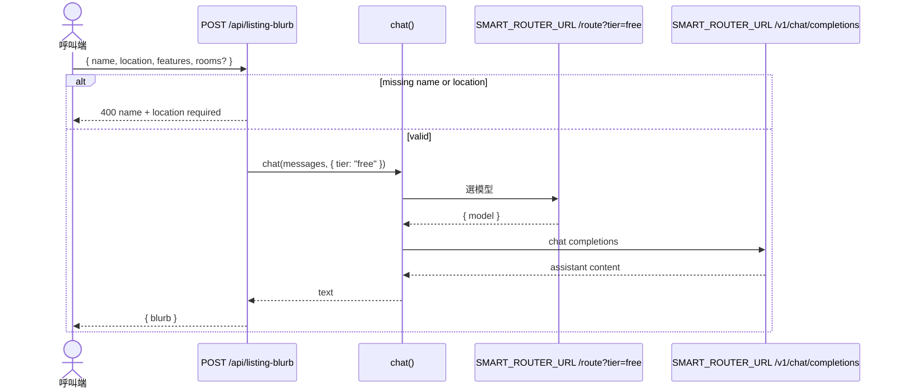

# StayMini 操作與業務流程

## 1. 房型瀏覽到詢問

首頁與房型頁都從 `rooms-store.ts` 讀三間 sample 房型。房型詳情頁用 `getRoomBySlug()` 驗證 slug，不存在時呼叫 `notFound()`。

## 2. 訂房詢問送出

`submitInquiry()` 檢查姓名、聯絡方式、入住/退房日、人數與房型。只有 `contacted` / `confirmed` 詢問會被 `findActiveOverlap()` 視為日期衝突；Mailgun 失敗不會阻擋表單完成。

## 3. 屋主查看詢問後台

`/admin/*` 由 `src/middleware.ts` Basic Auth 保護。頁面只讀 in-memory 詢問資料，沒有狀態更新表單或 API。

## 4. NewebPay 付款流程

`checkout` 目前只支援 `pricing.ts` 裡的 `pro` 方案。付款狀態以 `/notify` 為準；`/return` 只盡力解析訂單編號並導到成功頁。

## 5. AI 民宿介紹文產生

此 API 不在現有頁面中呼叫，但 route 已存在。若 `SMART_ROUTER_URL` 未設定，client 預設呼叫 `http://127.0.0.1:8765`。
