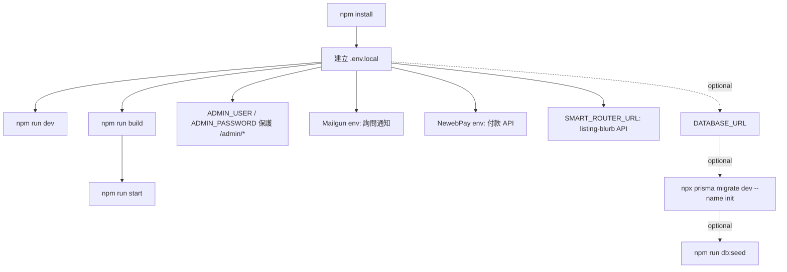

# StayMini 安裝、執行、部署、維運

## 執行與部署流程



## 環境需求

| 項目 | 需求 |
| --- | --- |
| Node.js | `package.json` 未宣告 `engines`；依 devDependencies 的 `@types/node` 與 Next.js 15，建議使用 Node.js 22 LTS |
| npm | repo 使用 `package-lock.json`，建議用 `npm install` |
| 資料庫 | 目前 app 可無資料庫啟動；若要 Prisma 持久化，需 PostgreSQL / Neon-compatible `DATABASE_URL` |
| 外部服務 | Mailgun、NewebPay、Smart Router 皆依功能選配 |

## 安裝與本機啟動

```bash
npm install
cp .env.example .env.local
npm run dev
```

開發伺服器預設由 Next.js 啟動在 `http://localhost:3000`。若要使用 `/admin/inquiries`，請在 `.env.local` 補上 `ADMIN_USER` 與 `ADMIN_PASSWORD`；這兩個變數目前由程式讀取，但尚未列在 `.env.example`。

## package scripts

| 指令 | 實際 script | 用途 |
| --- | --- | --- |
| `npm run dev` | `next dev` | 本機開發伺服器 |
| `npm run build` | `next build` | production build |
| `npm run start` | `next start` | 啟動 production server |
| `npm run lint` | `next lint` | lint script；是否可執行取決於目前 Next.js CLI 支援 |
| `npm run typecheck` | `tsc --noEmit` | TypeScript 型別檢查 |
| `npm run db:seed` | `tsx prisma/seed.ts` | 將三間 sample 房型 upsert 到 Prisma DB |
| `postinstall` | `prisma generate \|\| true` | 安裝後產生 Prisma Client；失敗不阻斷 install |

## 環境變數

| 變數 | 出處 | 必要性 | 說明 |
| --- | --- | --- | --- |
| `DATABASE_URL` | `.env.example`、`prisma/schema.prisma` | Prisma migration / seed 需要；目前 runtime 不需要 | PostgreSQL 連線字串。不要提交真實值 |
| `ADMIN_USER` | `src/middleware.ts` | 使用 `/admin/*` 必要 | Basic Auth 帳號；缺少時 `/admin/*` 回 `503` |
| `ADMIN_PASSWORD` | `src/middleware.ts` | 使用 `/admin/*` 必要 | Basic Auth 密碼；缺少時 `/admin/*` 回 `503` |
| `MAILGUN_API_KEY` | `.env.example`、`src/lib/mailgun.ts` | 選配 | Mailgun API key；缺少時通知 no-op |
| `MAILGUN_DOMAIN` | `.env.example`、`src/lib/mailgun.ts` | 選配 | Mailgun domain |
| `MAILGUN_FROM_EMAIL` | `.env.example`、`src/lib/mailgun.ts` | 選配 | Mailgun 寄件 Email；與 key/domain 都存在才會寄送 |
| `MAILGUN_FROM_NAME` | `.env.example`、`src/lib/mailgun.ts` | 選配 | Mailgun 寄件顯示名稱 |
| `MAILGUN_REGION` | `.env.example`、`src/lib/mailgun.ts` | 選配 | 預設 `api.mailgun.net`；EU 可設 `api.eu.mailgun.net` |
| `SMART_ROUTER_URL` | `src/lib/router-client.ts` | 使用 `/api/listing-blurb` 時需要可連線服務 | 未設定時預設 `http://127.0.0.1:8765` |
| `NEWEBPAY_MERCHANT_ID` | `.env.example`、`src/lib/payment/newebpay.ts` | 呼叫 checkout 必要 | NewebPay 商店代號 |
| `NEWEBPAY_HASH_KEY` | `.env.example`、`src/lib/payment/newebpay.ts` | 呼叫 checkout / decode callback 必要 | NewebPay HashKey |
| `NEWEBPAY_HASH_IV` | `.env.example`、`src/lib/payment/newebpay.ts` | 呼叫 checkout / decode callback 必要 | NewebPay HashIV |
| `NEWEBPAY_API_BASE` | `.env.example`、`src/lib/payment/newebpay.ts` | 選配 | 程式預設 `https://ccore.newebpay.com`；`.env.example` 目前示範 `https://core.newebpay.com` |
| `NEXT_PUBLIC_SITE_URL` | `.env.example`、payment routes | 金流正式環境建議設定 | 產生 return / notify / clientBack URL；未設定時使用 request origin |
| `NEXTAUTH_SECRET` | `.env.example` | 目前未使用 | `.env.example` 預留；程式未安裝或使用 Auth.js |
| `NEXTAUTH_URL` | `.env.example` | 目前未使用 | `.env.example` 預留；程式未安裝或使用 Auth.js |
| `NODE_ENV` | Next.js / Prisma | 自動 | `src/lib/prisma.ts` 依此調整 Prisma log 與 global cache |

## 部署方式

repo 沒有 `vercel.json`、Dockerfile、`docker-compose.yml` 或 Makefile。實際可用部署路徑是標準 Next.js：

```bash
npm install
npm run build
npm run start
```

Vercel 也可部署 Next.js App Router 專案，但需在 Vercel 專案環境變數中補上需要的 env。若部署 `/admin/*`，務必設定 `ADMIN_USER`、`ADMIN_PASSWORD`；若使用 NewebPay，`NEXT_PUBLIC_SITE_URL` 應設為正式網域，避免 callback URL 產生錯誤。

## 常見維運操作

| 操作 | 指令 / 位置 | 注意事項 |
| --- | --- | --- |
| 型別檢查 | `npm run typecheck` | 使用 TypeScript `strict` |
| production build | `npm run build` | 部署前建議執行 |
| Prisma 建表 | `npx prisma migrate dev --name init` | 目前不是 package script；需先設定 `DATABASE_URL` |
| Prisma seed | `npm run db:seed` | 只 seed `Room`；需先 migrate |
| Prisma Client 產生 | `npx prisma generate` 或 install 後 `postinstall` | `postinstall` 使用 `|| true`，失敗不會中止安裝 |
| 詢問資料 | `src/lib/inquiries-store.ts` | in-memory；server 重啟或 serverless instance 更換會遺失 |
| 房型資料 | `src/lib/rooms-store.ts` | 三間 sample 房型硬編碼；正式民宿需替換 |
| 訂單資料 | `src/lib/payment/order-store.ts` | in-memory；付款正式上線前需改為持久化 |
| Mailgun 通知 | `src/lib/inquiry-notify.ts` | best-effort；寄信失敗不阻擋詢問 |
| cron | 無 | repo 未定義 cron 或排程 |
| 備份 | 無內建 | 若切到 PostgreSQL，需由 Neon / DB provider 設定備份 |

## 上線前檢查

- 將 `siteConfig` 與 `COMPANY` 的 placeholder 聯絡資訊、地址、地圖、圖片換成真實資料。
- 決定是否繼續使用 in-memory store；若要保留詢問與訂單，需把 store 換成 Prisma。
- 對齊 Prisma `OrderProvider` enum 與 runtime `NEWEBPAY` 型別。
- 設定 `/admin/*` Basic Auth env，並確認正式環境不會回 `503`。
- 設定 NewebPay 正式 / 測試 API base、HashKey、HashIV、Merchant ID。
- 確認 Mailgun domain、sender、收件 owner email 可正常寄送。
