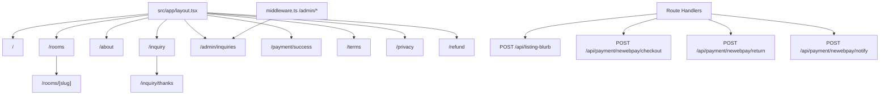

# StayMini 頁面、路由與 API 清單

## 路由地圖

## 頁面路由

| 路徑 | 檔案 | 用途 | 是否需登入 |
| --- | --- | --- | --- |
| `/` | `src/app/page.tsx` | 首頁 hero、特色、房型預覽、詢問 CTA | 否 |
| `/rooms` | `src/app/rooms/page.tsx` | 三間房型列表、價格、人數、設備摘要 | 否 |
| `/rooms/[slug]` | `src/app/rooms/[slug]/page.tsx` | 單一房型圖庫、介紹、設備、詢問 CTA | 否 |
| `/about` | `src/app/about/page.tsx` | 民宿故事、聯絡資訊、地址、Google Maps iframe | 否 |
| `/inquiry` | `src/app/inquiry/page.tsx` | 訂房請求表單；支援 `?room={slug}` 預選房型 | 否 |
| `/inquiry/thanks` | `src/app/inquiry/thanks/page.tsx` | 詢問送出後顯示感謝訊息與詢問編號 | 否 |
| `/admin/inquiries` | `src/app/admin/inquiries/page.tsx` | 屋主查看 in-memory 詢問列表 | 是，Basic Auth |
| `/payment/success` | `src/app/payment/success/page.tsx` | NewebPay return 後的付款結果顯示頁；支援 `?order={merchantOrderNo}` | 否 |
| `/terms` | `src/app/terms/page.tsx` | 服務條款 | 否 |
| `/privacy` | `src/app/privacy/page.tsx` | 隱私權政策 | 否 |
| `/refund` | `src/app/refund/page.tsx` | 取消與退訂政策 | 否 |
| `not-found` | `src/app/not-found.tsx` | 404 頁面 | 否 |

`/admin/*` 由 `src/middleware.ts` 攔截。缺少 `ADMIN_USER` 或 `ADMIN_PASSWORD` 時回 `503`；帳密錯誤時回 `401` 並帶 `WWW-Authenticate`。

## API endpoints

| 方法 | 路徑 | 檔案 | 用途 | 是否需登入 |
| --- | --- | --- | --- | --- |
| `POST` | `/api/listing-blurb` | `src/app/api/listing-blurb/route.ts` | 接收 `name`、`location`、`features`、`rooms`，透過 Smart Router 產生繁中民宿介紹文 | 否 |
| `POST` | `/api/payment/newebpay/checkout` | `src/app/api/payment/newebpay/checkout/route.ts` | 建立 in-memory order，回傳 NewebPay MPG endpoint 與 encrypted params | 否 |
| `POST` | `/api/payment/newebpay/return` | `src/app/api/payment/newebpay/return/route.ts` | NewebPay browser return；盡力解析 `MerchantOrderNo` 後 303 導到 `/payment/success` | 否 |
| `POST` | `/api/payment/newebpay/notify` | `src/app/api/payment/newebpay/notify/route.ts` | NewebPay server-to-server notify；依 `Status` 標記 order 為 `PAID` 或 `FAILED` | 否 |

## Server Action

| 函式 | 檔案 | 觸發頁面 | 用途 |
| --- | --- | --- | --- |
| `submitInquiry()` | `src/app/inquiry/actions.ts` | `/inquiry` 的 `InquiryForm` | 驗證表單、檢查房型與日期衝突、建立 in-memory inquiry、best-effort 呼叫 Mailgun、redirect 到 `/inquiry/thanks` |

## 重要模組

| 模組 | 用途 |
| --- | --- |
| `src/lib/site-config.ts` | 民宿名稱、tagline、聯絡方式、地址、地圖、hero 圖 |
| `src/lib/company.ts` | 公司登記與客服資訊，供 footer 與法務頁使用 |
| `src/lib/rooms-store.ts` | 三間 sample 房型與 `listRooms()` / `getRoomBySlug()` |
| `src/lib/inquiries-store.ts` | in-memory inquiry CRUD 與日期衝突檢查 |
| `src/lib/inquiry-notify.ts` | 把新詢問整理成 Mailgun 訊息 |
| `src/lib/mailgun.ts` | Mailgun HTTP API client |
| `src/lib/router-client.ts` | Smart Router client，供 AI route 使用 |
| `src/lib/payment/pricing.ts` | `pro` 方案與 3% commission 計算 |
| `src/lib/payment/newebpay.ts` | NewebPay TradeInfo AES encode/decode 與 TradeSha |
| `src/lib/payment/order-store.ts` | in-memory order / booking store 與付款狀態更新 |
| `src/lib/prisma.ts` | PrismaClient singleton；目前 runtime 未被頁面/API 使用 |
